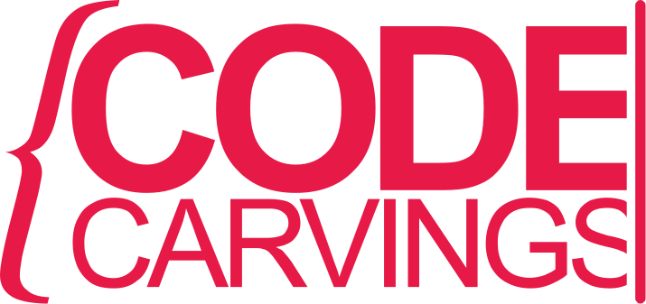
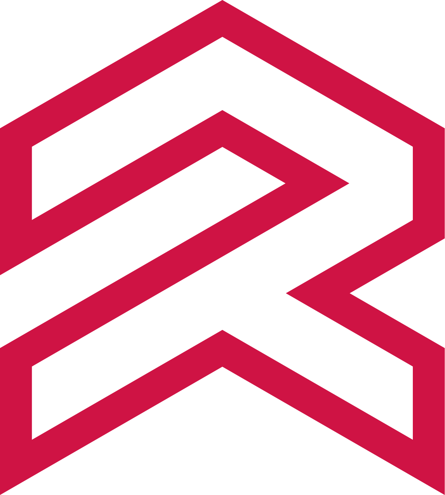

---
[codecarvings.com](https://codecarvings.com) | [LinkedIn](https://www.linkedin.com/in/turolla/)

---

```MEET THE PROJECT```



## R-Machine — Uniformity Under Change for TypeScript

**R-Machine is a TypeScript library that reduces the cost and the risk of change — in the code and in the tests — for React and Next.js projects.**

A codebase is a dynamic entity: it evolves refactor after refactor, sprint after sprint, LLM iteration after LLM iteration. A useful question when evaluating an architecture is not only "**can it do X?**" but "**how many files must change when X evolves?**" — production code, tests, mocks, fixtures. Every file you touch is a cost, but also a risk: the more code changes, the more likely something breaks.

R-Machine unifies in a single model what today requires separate libraries for state management, i18n, dependency injection, and testing. The result is not the sum of four separate benefits: it's a new property, one I call "*uniformity under change*". You feel it at every scale: **LLM iterations guided by the TypeScript compiler as an oracle, complex refactorings with a contained blast radius, fewer false greens in your tests.**

- [rmachine.dev](https://rmachine.dev)
- [GitHub repo](https://github.com/codecarvings/r-machine)
